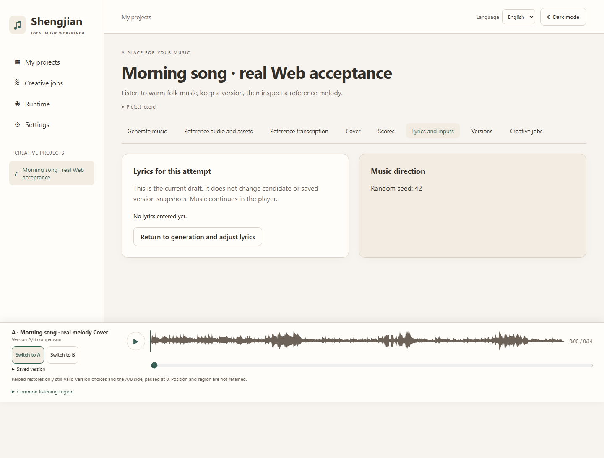

<div align="center">


# 声间 · Shengjian

**A place for your music.**<br>
*A local AI workbench for making, understanding, and reshaping songs.*

[English](README.md) · [简体中文](README.zh-CN.md) · [📖 Documentation](https://caizongyuan.github.io/llm-music/en/overview/) · [🎧 Hear a real example](https://caizongyuan.github.io/llm-music/en/overview/#listen)

[](https://github.com/CaiZongyuan/llm-music/actions/workflows/web-foundation.yml)
[](https://github.com/CaiZongyuan/llm-music/actions/workflows/application-api.yml)
[](https://github.com/CaiZongyuan/llm-music/actions/workflows/browser-tests.yml)
[](https://github.com/CaiZongyuan/llm-music/actions/workflows/documentation.yml)


</div>

---

Start with a mood and a few lyric lines, or bring a reference melody. Generate music, inspect its score, change a phrase, and listen to another direction. Shengjian keeps the audio, notation, inputs, and saved versions together in one Project on your own machine.

<div align="center">



*Actual Web application with locally generated melody/full Cover music. [Screenshot provenance](apps/docs/public/images/shengjian-workspace.provenance.json).*

</div>

## ✨ Make something, then make it yours

| Start with | What you can do | Try it |
| --- | --- | --- |
| 🎤 Style + lyrics | Generate a short song, hear the result, and inspect its ABC score. | [Make your first music](https://caizongyuan.github.io/llm-music/en/first-music/) |
| 🎼 Reference audio | Transcribe a melody into ABC/MIDI, inspect notation, and compare it with the original. | [Explore a reference](https://caizongyuan.github.io/llm-music/en/reference/) |
| ✏️ An editable score | Edit ABC, preview notation, audition/export matching MIDI, save/select the Score, and generate new music from it. | [Edit and regenerate](https://caizongyuan.github.io/llm-music/en/edit-score/) |
| 🎭 A new interpretation | Inspect the transcription first, then use melody or full Cover conditioning with another style. | [Try Cover](https://caizongyuan.github.io/llm-music/en/cover/) |
| 🔀 A version you like | Continue from a saved Version, keep branches, and compare two saved works in the persistent A/B player. | [Explore variations](https://caizongyuan.github.io/llm-music/en/variations/) |

> **Candidate → Version.** Generation creates a **Candidate** you can audition and revisit. It becomes a **Version** when you explicitly save it. Saved inputs, outputs, and parent links preserve the choices behind each result; later drafts and generations leave that work intact.

The player stays with you across workspace tabs. Switch A/B at the same absolute second, seek through the waveform, or play a common region once. Reload restores valid saved-Version choices and the active side, paused at the beginning; playback position and region are session-only.

The Web supports English and Simplified Chinese, light and dark themes, job tracking, cancellation, explicit retries, and recovery after interrupted reads or saves. Music creation happens in the local workbench; the documentation site provides tutorials and existing listening examples.

## 🚀 Open the workbench without a GPU

Use CPU Fake Runtime to explore the workflow or develop the application. Install Git, Node.js 24, pnpm **11.22.0**, and [uv](https://docs.astral.sh/uv/). The API uses Python 3.12; the verified environment is Windows x64.

Run these commands from a terminal:

```powershell
git clone https://github.com/CaiZongyuan/llm-music.git
cd llm-music
pnpm install --frozen-lockfile
uv sync --project services/api --frozen
pnpm dev -- --mode fake --open
```

The launcher builds the API client, starts FastAPI and Web, and opens **http://127.0.0.1:5173** after health checks pass. Create a Project, enter a style and lyrics, generate a Candidate, then explicitly save a Version.

> [!WARNING]
> **Fake mode produces fixtures, including a 440 Hz test tone. It does not generate model music or demonstrate music quality.** It needs no GPU, model weights, Torch, or ComfyUI.

Press **Ctrl+C** to stop the services started by that session. Projects, Assets, Candidates, and Versions remain in `data/dev/fake/application/`. The launcher prints a session receipt and log paths; see [startup, ports, reuse, and recovery](https://caizongyuan.github.io/llm-music/en/dev-launcher/).

## 🎛️ Generate real music locally

Prepare the pinned ComfyUI/YuE2/SheetSage2 Runtime and model files using the [Runtime preparation guide](https://caizongyuan.github.io/llm-music/en/quickstart/). The guide covers its independent Python 3.12.13 environment, approximately **9.19 GB** of weights, GPU/driver checks, and Doctor recovery.

Once the API dependencies and Runtime are prepared, and no existing Runtime is listening, start from the repository root:

```powershell
pnpm dev -- --mode comfyui --open
```

This starts three independent services: Web, FastAPI, and ComfyUI. The launcher checks readiness and process ownership; it does not install Runtime dependencies or download models. For an already running Runtime, follow the [verified reuse procedure](https://caizongyuan.github.io/llm-music/en/dev-launcher/#native).

Real application data lives separately in `data/dev/comfyui/application/`. FastAPI and ComfyUI have their own **uv projects, virtual environments, and lockfiles**. All services bind to `127.0.0.1`; Web talks to FastAPI, and FastAPI handles inference and imports the results into application-owned storage.

The demonstrated GPU profile is **Windows x64 · RTX 3070 Ti Laptop · 8 GB VRAM**, with approximately **35-second** generated clips. That is a verified target, rather than a compatibility guarantee for every 8 GB GPU. The current transcription profile accepts **16-second PCM16 WAV**, mono 24 kHz or stereo 48 kHz. Cover can also extract the first 16 seconds of a saved Version as a new reference.

## ✅ What has been verified

The current MVP connects generation, transcription, ABC editing, MIDI audition/export, regeneration, both Cover modes, saved branches, and A/B listening through the real Web/FastAPI/ComfyUI path.

- Real GPU acceptance includes an uncached branch from a saved full Cover Version: approximately 35 seconds of decoded stereo music, with **37.694 seconds** of measured workflow execution on the target machine.
- An actual API process restart retained the saved records and all **22 Asset hashes** in that acceptance dataset; a cold browser recovered the saved comparison and original audio.
- The complete **17-case saved-Version comparison suite** passed in both documented music CI runs. CPU fixtures validate application behavior; real GPU receipts establish the separately recorded inference results.

See the [MVP acceptance record](docs/verification/mvp.md), [target-machine Runtime report](docs/verification/p0-runtime-report.md), and [real music delivery](https://github.com/CaiZongyuan/llm-music/pull/95#issuecomment-6071434961).

> [!IMPORTANT]
> The current workbench focuses on short clips and one local user with one GPU queue. Long-song generation, arbitrary reference formats, exact transcription/acoustic fidelity, and other hardware profiles are outside the demonstrated scope. Cover modes describe score conditioning; they do not promise to preserve a singer's identity or every generated note.

## 🏗️ For developers

```text
┌────────────────────────────────────────────────┐
│  Web · React / Vite / TanStack Router + Query  │
└──────────────────────────┬─────────────────────┘
                           │  HTTP / WebSocket
┌──────────────────────────▼─────────────────────┐
│  API · FastAPI · SQLite · local Asset storage  │
└──────────────────────────┬─────────────────────┘
                           │  Runtime adapter
┌──────────────────────────▼─────────────────────┐
│     Runtime · ComfyUI · YuE2 · SheetSage2      │
└────────────────────────────────────────────────┘
```

FastAPI owns Projects, Assets, Scores, Jobs, Candidates, and Versions. Its Pydantic/OpenAPI contract generates the TypeScript client. ComfyUI provides inference; its nodes and prompts stay behind the Runtime boundary.

| Path | Purpose |
| --- | --- |
| [`apps/web/`](apps/web/) | React music workspace, notation, and continuous audio player |
| [`services/api/`](services/api/) | Application API, persistence, and Runtime adapter |
| [`runtime/comfyui/`](runtime/comfyui/) | Pinned Runtime, model registry, preparation, and Doctor |
| [`packages/api-client/`](packages/api-client/) | Generated TypeScript API client |
| [`workflows/`](workflows/) | Versioned inference definitions and manifests |
| [`docs/`](docs/) · [`apps/docs/`](apps/docs/) | Paired documentation sources and Astro/Starlight site |

Useful root commands after dependency installation:

```powershell
pnpm web:check
pnpm client:check
pnpm test:launcher
pnpm docs:check
pnpm docs:build
```

For browser testing, start with the [verification guide](docs/guides/browser-tests.en.md). Read [AGENTS.md](AGENTS.md) and the [production plan](docs/production.md) before changing scope or architecture. Specifications and work are tracked in [GitHub Issues](https://github.com/CaiZongyuan/llm-music/issues).

## 📄 License

The Shengjian source code is released under the [MIT License](LICENSE).

The registered model weights (YuE2, SheetSage2) keep their upstream **CC-BY-NC-4.0** license. They are prepared separately and are not distributed with this repository. Model and upstream code licenses are recorded in the [model registry](runtime/comfyui/models.json) and [Runtime configuration](runtime/comfyui/runtime.json).

---

<div align="center">

**声间 · Shengjian** — your music, your machine.

[📖 Documentation](https://caizongyuan.github.io/llm-music/en/overview/) · [🎧 Listen first](https://caizongyuan.github.io/llm-music/en/overview/#listen) · [🐝 Issues](https://github.com/CaiZongyuan/llm-music/issues)

</div>
