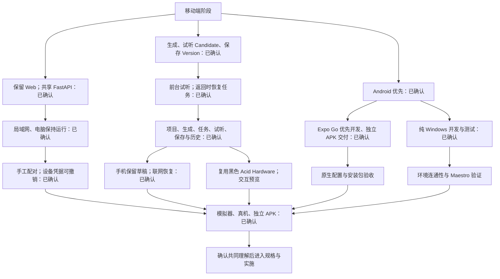

# 移动端方案访谈

日期：2026-10-09 起。状态：三轮建议与 2026-10-10 完整交互预览均已确认，进入正式实施。本文记录 `grill-with-docs` 的设计访谈与后续授权，不是实施规格；规格与实施票据沿用 GitHub Issues。

## 第一轮：已确认

用户回答“都按你的建议”，确认以下三项：

| 决策 | 已确认的选择 |
| --- | --- |
| 客户端方向 | 保留 Web，在其后新增独立移动端阶段，共用现有 FastAPI 与创作数据。 |
| 首版定位 | 便携客户端，先完成“生成 → 试听 Candidate → 明确保存 Version”。 |
| 验收平台 | Android 先验收；iOS 适配与验收另行规划。 |

范围与取舍已记录在 [ADR-005](../adr/0005-mobile-companion-scope.md)，并同步到 [生产规划](../production.md)。沿用 [领域术语](../../GLOSSARY.md)；Expo Go、development build、ADB 与 Maestro 属于通用技术概念，不加入领域词汇表。

## 设计树

产品选择均已在三轮访谈中确认。交互预览、环境连通性、原生配置与安装包验证是后续执行及验收步骤，尚未完成；完整方案确认后进入该流程。

## 第二轮：已确认，环境已纠正

用户再次回答“都按你的建议”，并明确纠正为纯 Windows 开发、不涉及 WSL。以下采用已确认建议，并以该纠正取代原来的 WSL/Windows 分工。

| 问题 | 已确认的选择 | 后续边界 |
| --- | --- | --- |
| Q4：连接范围 | 手机与 GPU 电脑在同一局域网，电脑保持运行；公网访问另行规划。 | 配对与撤销机制已在第三轮确认，实际入口尚未实现。 |
| Q5：切到后台 | 后端继续生成，返回 App 时用 HTTP 恢复任务状态；首版只做前台试听。 | 锁屏播放、完成推送属于后续能力。 |
| Q6：开发与交付 | 日常优先 Expo Go，最终交付独立 APK；原生配置和安装包使用 development build／正式构建验收。 | 实际二进制与 APK 尚未构建或测试。 |
| Q7：工具位置 | 代码、Metro、Android Emulator、ADB、Maestro 全部在 Windows 运行。 | 本机 Android SDK、AVD 与 Maestro 环境仍需实际验证。 |

## 第三轮：已确认

用户回答“都按你的建议，我安装了安卓studio”，确认第三轮全部建议。Android Studio 的安装是环境准备进展，不能代替模拟器或应用验收。

| 问题 | 已确认的选择 | 后续边界 |
| --- | --- | --- |
| Q8：首次连接 | 电脑显示地址与短时配对码，手机手工输入一次并保存设备凭据；电脑可撤销配对，维持单用户工作台。 | 扫码配对后续规划；HTTP、WebSocket 和音频读取都需验证鉴权与撤销。 |
| Q9：首版操作 | 项目列表/新建、风格与歌词输入、生成、任务状态/取消/明确重试、播放/暂停/seek、命名保存 Version、查看已有版本。 | 复用现有生成参数；录音、素材上传、分享后续按需求扩展。 |
| Q10：断网与草稿 | 手机保留编辑草稿；断网保留输入，联网后读取原任务，结果未知时先核对已有记录；离线音乐库后续规划。 | 网络恢复不自动重发创作请求；草稿修改不改写既有输入快照。 |
| Q11：验收范围 | Android 模拟器、至少一台 Android 真机及独立 APK；日常 Maestro 使用隔离 Fake Runtime，交付时运行真实 GPU 创作闭环。 | Maestro UI 结果、音频行为和真实 GPU 推理证据分别记录。 |

验收覆盖中文/多行歌词输入、正常/空/加载/失败状态、连接恢复、未知提交结果与重复提交控制、原始 FLAC 播放及 seek、Candidate 明确保存、App/后端重启恢复。Maestro UI 结果、音频行为和真实 GPU 推理证据分别记录。以上是已确认的验收目标，实际测试仍未执行。

## 完整方案与执行顺序

保留 Web 工作台，在同一仓库新增 Android 便携客户端；手机与保持运行的 GPU 电脑在同一局域网，共用 FastAPI 所拥有的 Project、Asset、Job、Candidate、Version。采用 Expo SDK 57、React Native 与 TypeScript，JS 继续由 pnpm 管理；FastAPI 与 ComfyUI 保持独立 uv 项目。当前核查的稳定补丁为 `expo@57.0.27`，其 React/RN 和 Expo 模块须使用 SDK 配套版本，实际依赖以实施时的锁文件为准。

首版操作、配对、草稿与验收边界以三轮记录为准。日常优先 Expo Go；需要验证项目自身原生配置时使用 development build，最终验证可独立安装的 Android APK。所有开发与测试工具在 Windows；iOS、公网访问、账号体系、锁屏播放、完成推送、完整音乐工作台和离线音乐库不进入本轮首版。

移动端视觉复用已确认的黑色 Acid Hardware 方向及最新纠正，来源为 [UI 方向记录](../ui/ui-direction.md)。小屏布局与新增电脑配对流程通过隔离的交互预览确认；预览保留于 `docs/previews/`，反馈保留于 `docs/ui/`，关键操作及空/加载/失败状态可执行，模拟数据与真实写入隔离。

完整方案确认后，执行顺序如下：

1. 准备 Windows Android 环境：统一 SDK/ADB，安装固定 system image，创建 AVD，确认 Expo Go 与 SDK 匹配，并准备 Windows 原生 Maestro。分别验证模拟器、Metro 与测试驱动的通路。
2. 交付并验证隔离交互预览：覆盖手机的完整首版流程及电脑端配对入口，在真实浏览器审阅预览，并用 Android 检查原生交互。记录用户反馈与确认。
3. 按 [追踪器规则](../agents/issue-tracker.md) 完成规格草案、确认与 GitHub Issues 发布，拆出环境、局域网接入、移动端闭环、测试和交付的真实依赖；准备与预览中得到的事实进入规格。
4. 实现 FastAPI 局域网配对与鉴权入口，同时验证现有 Web 消费者；ComfyUI 仍仅监听本机。HTTP、WebSocket 与 Asset 读取统一验证设备授权、撤销与失败恢复。API 变更同步 OpenAPI、生成 client、测试和文档。
5. 在 `apps/mobile` 实现已确认闭环：使用 SDK 配套原生能力进行前台音频播放，验证现有 API client 的 RN 兼容性；手机保存草稿与设备凭据，服务器继续拥有持久创作结果。共享实际接口与领域定义，不复制 Web DOM 组件，也不提前建立多客户端 UI 抽象。
6. 运行隔离 Fake Runtime 的 Maestro 日常验证，再在模拟器、真机和独立 APK 中完成验收；补齐真实 GPU 创作与原始 FLAC 播放/seek 证据，记录实际软件版本、应用 binary、数据命名空间及恢复结果。

Android Studio 安装后的最初 SDK/AVD 状态见 [Windows 环境调研](../research/mobile-windows-maestro-facts.md)。在后续用户授权初始化后，已补齐系统镜像、创建 AVD、配置 Maestro 并完成隔离启动预览，实际结果见 [初始化验证](../verification/mobile-bootstrap.md)。业务流程预览、规格发布与完整移动端实施继续按已确认范围推进。

## 后续授权：先初始化并试跑

2026-10-10，用户明确要求“你先初始化一个 mobile 然后试一下能跑通吗”，授权直接进入 Windows 环境准备、`apps/mobile` 初始化及 Expo Go 验证；这一指示优先于前文等待整体确认后才执行的顺序。随后用户更新 Expo 技能列表，并要求使用 Expo 技能；初始化按 `expo-overview` 及相关子技能完成。

当前交付是 Expo SDK 57 的隔离启动验证页面、公开 pnpm 启动/测试入口及实际 Android Maestro / Chromium / Fast Refresh 证据。此授权与技术结果不代替完整项目创作或配对流程的视觉确认，也不代表业务 FastAPI/GPU、真机或独立产品 APK 已验收。

## 事实与验证边界

2026-10-10，完整手机工作流与电脑配对入口的隔离预览已交付，并完成 Android Maestro、Chromium、控件兼容修复及非作者审阅。用户收到预览入口与接入真实后端的确认请求后明确回复“确认”。该确认授权按此界面与流程继续正式业务实施、发布规格和实施票据，见 [UI 记录](../ui/mobile-workbench-preview.md)。不重复请求已确认的产品选择或视觉准入；新增实质范围另按实际需要处理。

- Expo SDK 57 已发布。固定原生宿主中的调试结果不能代替本项目二进制的原生配置与权限验证；详见 [Expo 调研](../research/mobile-expo-facts.md)。
- Maestro 官方提供 Expo Go 与 Windows 原生路径；本机尚未实际启动模拟器并完成整条测试链路。详见 [Windows 与 Maestro 调研](../research/mobile-windows-maestro-facts.md)。
- 当前 API CLI 的 `--host` 只接受 loopback 地址，开发启动器同样固定 `127.0.0.1`。真实手机局域网访问会改变当前连接边界，不能仅更换客户端 URL。来源：[API CLI](../../services/api/src/music_api/cli.py)、[API 启动器](../../scripts/dev_api.py)、[生产规划安全边界](../production.md#62-安全边界)。
- `packages/api-client` 提供由 OpenAPI 生成的接口类型、HTTP client 和任务 WebSocket URL，是候选复用入口；尚未在 React Native 上运行验证。现有乐谱加载器与 MIDI 下载依赖浏览器 DOM，不能据此承诺 Web UI 可直接迁移。来源：[API client](../../packages/api-client/src/index.ts)、[乐谱加载](../../apps/web/src/features/scores/abcjs.ts)、[MIDI](../../apps/web/src/features/scores/midi.ts)。
- 现有生成音频采用 48kHz、双声道、16bit FLAC。Android 媒体框架的格式支持不等于真实样本的播放、seek 与网络读取已通过；移动端仍需验证原始生成样本。来源：[音频验证](../../services/api/src/music_api/generation_audio.py)、[Expo 调研](../research/mobile-expo-facts.md)。

三轮产品选择已经记录，用户后续授权的初始化与试跑已完成，见 [初始化验证](../verification/mobile-bootstrap.md)。正式移动端规格与业务流程实施尚未发布或验收。
